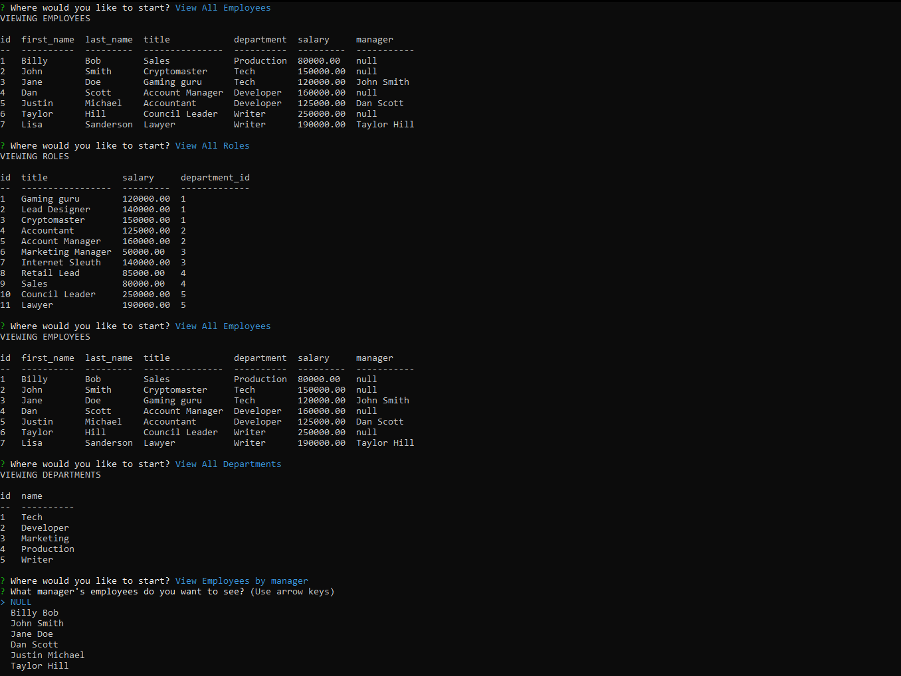

# employee-tracker

## Descripton
A command-line content management system which can be used to manage employee data.

## Functionality
* View All Employees
* View All Roles
* View All Departments
* View Employees by manager
* Add Employee
* Add role
* Update Employee Role

## Technology USed
* MySql
* Node.js
* Javascript

## Installation
Run "npm i" from root directory.  Run "node server" to start application and follow the prompts to acces the content management system

## Video
[Link to video of deployed app](https://drive.google.com/open?id=1CE493VvJ1JKWNJkbDWUjzh3owDUeJRrz&authuser=adambowers09%40live.com&usp=drive_fs)

## Screenshot
